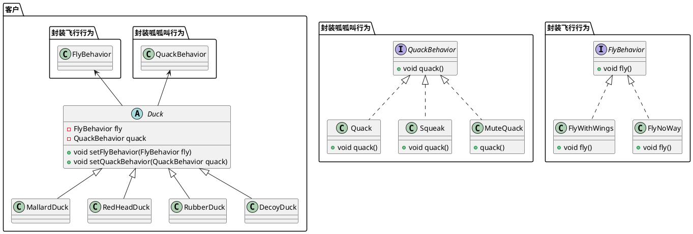

### 策略模式

#### 介绍

，类图如下：

```plantuml
@startuml
namespace 客户 {
    abstract class Duck {
        - FlyBehavior fly
        - QuackBehavior quack
        + void setFlyBehavior(FlyBehavior fly)
        + void setQuackBehavior(QuackBehavior quack)
    }
    class MallardDuck extends Duck
    class RedHeadDuck extends Duck
    class RubberDuck extends Duck
    class DecoyDuck extends Duck
    封装呱呱叫行为.QuackBehavior <-- 客户.Duck
    封装飞行行为.FlyBehavior <-- 客户.Duck
}
namespace 封装呱呱叫行为 {
    interface QuackBehavior {
        + void quack()
    }
    class Quack implements QuackBehavior {
        + void quack()
    }
    class Squeak implements QuackBehavior {
        + void quack()
    }
    class MuteQuack implements QuackBehavior {
        + quack()
    }
}
namespace 封装飞行行为 {
    interface FlyBehavior {
        + void fly()
    }
    class FlyWithWings implements FlyBehavior {
        + void fly()
    }
    class FlyNoWay implements FlyBehavior {
        + void fly()
    }
}
@enduml
```
